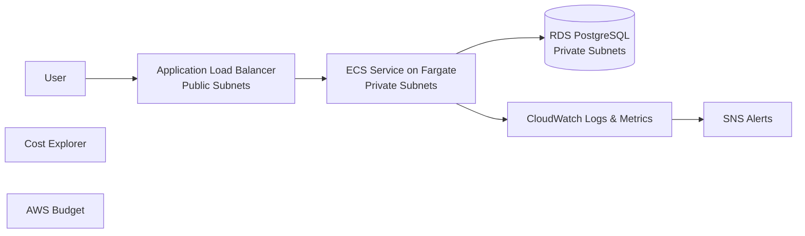
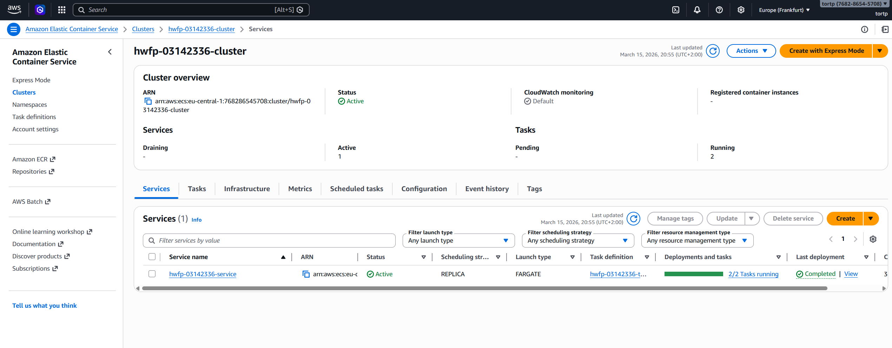
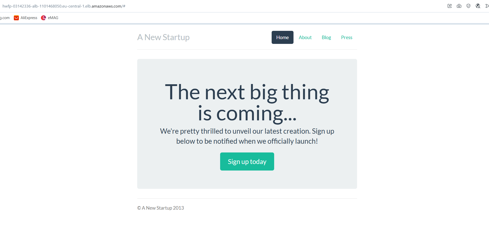
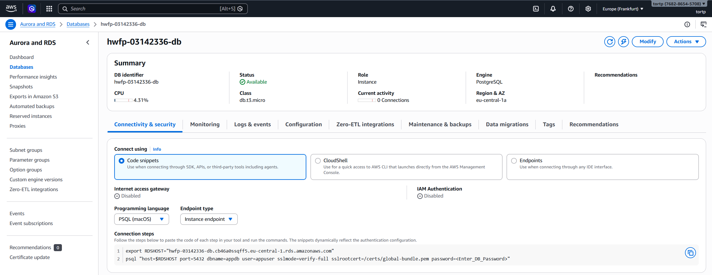
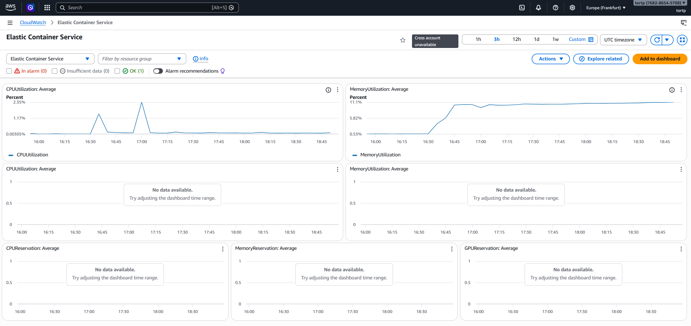
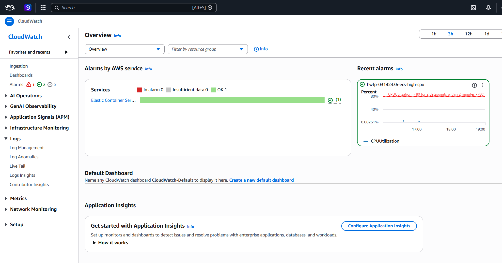
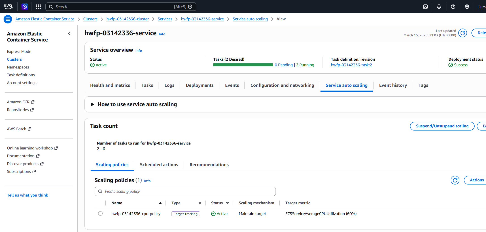
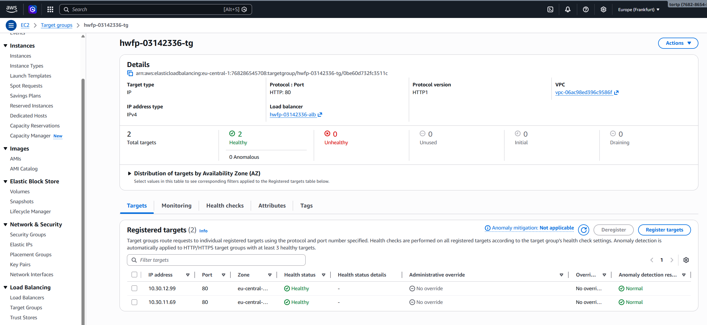
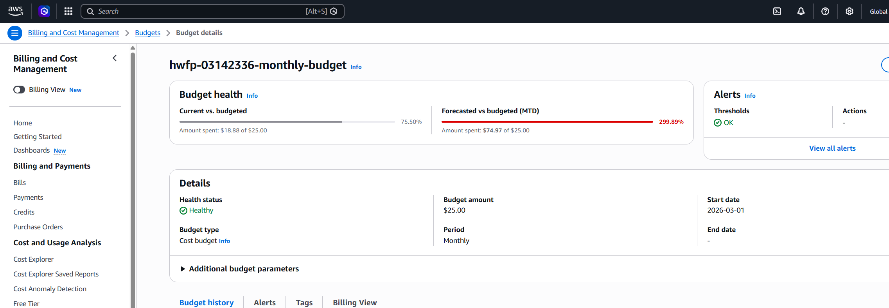
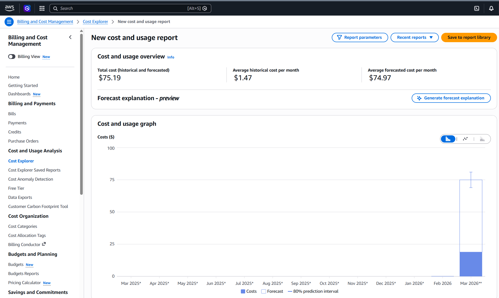

# Final Project (AWS)

## 1. Опис середовища 
Для фінального проєкту обрано **Amazon ECS (Fargate)**.

- Region: `eu-central-1`
- ECS Cluster: `hwfp-03142336-cluster`
- ECS Service: `hwfp-03142336-service`
- Public URL (ALB): `http://hwfp-03142336-alb-1101468050.eu-central-1.elb.amazonaws.com`

## 2. Обґрунтування вибору технологій
- **ECS Fargate** - керований запуск контейнерів без адміністрування EC2.
- **ECR** - зберігання та версіонування Docker image.
- **RDS PostgreSQL** - керована реляційна БД.
- **VPC + public/private subnets** - розділення мережі та контроль доступу.
- **Security Groups + IAM + Secrets Manager** - базова безпека та робота із секретами.
- **ALB** - публічна точка входу та балансування навантаження.
- **CloudWatch + SNS + Auto Scaling** - моніторинг, алерти, масштабування.
- **AWS Budget + Cost Explorer** - контроль та оптимізація витрат.

## 3. Архітектурна схема рішення

## 4. Інструкція з деплою та налаштувань
Деплой виконано вручну через AWS Console у такій послідовності:
1. Створено VPC, public/private subnets, route tables, IGW, NAT.
2. Налаштовано Security Groups та IAM ролі.
3. Створено RDS PostgreSQL у private subnets.
4. Підготовлено Docker image, завантажено в ECR.
5. Створено ECS Cluster/Service (Fargate), підключено ALB.
6. Налаштовано CloudWatch logs/metrics, alarm та SNS.
7. Налаштовано ECS Auto Scaling (min `2`, max `6`).
8. Створено AWS Budget (`25 USD`) та перевірено Cost Explorer (через AWS Console).

## 5. Скриншоти з підтвердженням

1. 
2. 
3. 
4. 
5. 
6. 
7. 
8. 
9. 

### 5.1 Розгортання середовища
- ECS Service: статус `ACTIVE`, running tasks `2/2`.
- ALB URL: `http://hwfp-03142336-alb-1101468050.eu-central-1.elb.amazonaws.com`, сторінка відкривається.
- RDS PostgreSQL instance: статус `available`.

### 5.2 Моніторинг у CloudWatch
- CloudWatch Logs: лог-група сервісу присутня.
- CloudWatch Alarm `hwfp-03142336-ecs-high-cpu`: стан `OK`.

### 5.3 Автомасштабування та балансування
- ECS Auto Scaling: min `2`, max `6`.
- ALB: listener `HTTP:80`, target group у стані healthy.
